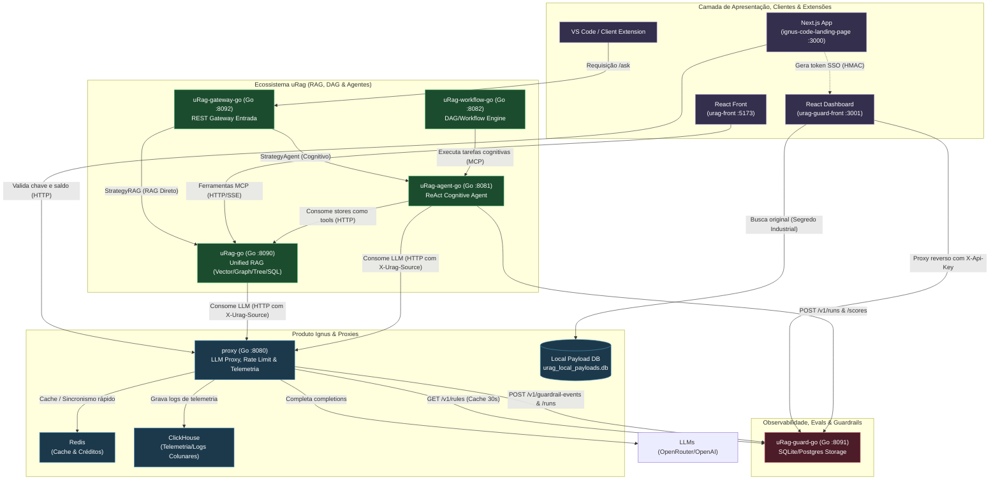

# Arquitetura Geral do Ecossistema (Ignus & uRag)

Este documento apresenta uma visão de alto nível de como todos os microsserviços se comunicam, divididos entre o ecossistema de assistente de código (**Ignus**) e o ecossistema de RAG e observabilidade (**uRag**).

---

## 🗺️ Diagrama de Arquitetura (Mermaid)

---

## 📦 Resumo por Serviço

### 1. Camada do Produto Ignus

#### [ignus-code-landing-page](file:///d:/PROJETOS/IGNUS/ignus-code-landing-page/README.md)
* **Papel**: Interface administrativa e frontend principal do assistente de código do usuário (Next.js/NextAuth).
* **Responsabilidades**:
  * Gerenciamento de chaves de API (`sk_ic_*`), saldo de créditos e conexões de provedores.
  * Resolução de metadados de chaves e saldo para o proxy Go.
  * Geração do token SSO assinado via HMAC para autenticar usuários no painel do uRag Guard.

#### [proxy (Go)](file:///d:/PROJETOS/IGNUS/ignus-code-landing-page/proxy/README.md)
* **Papel**: Proxy reverso de alta performance posicionado antes dos provedores de LLM.
* **Responsabilidades**:
  * Validação das chaves de API e consumo de créditos de forma atômica integrando com Next.js e Redis.
  * Execução em tempo real de **Guardrails** (Regex, Keywords e Webhooks externos) tanto no input (bloqueio antes do LLM) quanto no output (bloqueio/alerta após resposta).
  * Envio de telemetria bruta para ClickHouse e notificação de incidentes/runs de guardrails para o `uRag-guard-go`.

---

### 2. Camada de RAG & Agentes (uRag)

#### [uRag-go](file:///d:/PROJETOS/IGNUS/uRag-go/README.md)
* **Papel**: Motor de RAG unificado em um único binário de Go puro (sem dependências CGO externas).
* **Responsabilidades**:
  * **Vector RAG**: Busca vetorial local via SQLite/HNSW.
  * **Graph RAG**: Busca relacional em grafo in-memory extraído via LLM.
  * **Vectorless RAG (Tree)**: Navegação hierárquica baseada em headings estruturados de documentos.
  * **Text-to-SQL**: Tradução de perguntas para consultas estruturadas de banco de dados com parser read-only de segurança.
  * **Servidor MCP**: Disponibiliza todas as stores como ferramentas para agentes locais ou na rede (via HTTP/SSE).

#### [uRag-agent-go](file:///d:/PROJETOS/IGNUS/uRag-agent-go/README.md)
* **Papel**: Agente autônomo baseado no loop cognitivo **ReAct** (Reasoning + Acting).
* **Responsabilidades**:
  * Orquestra a resolução de prompts complexos utilizando as stores do `uRag-go` como ferramentas.
  * Realiza **avaliações locais** de fidelidade (Evals, como *faithfulness* via LLM-as-judge) no término da execução.
  * Registra as estatísticas e pontuações geradas no `uRag-guard-go` de forma assíncrona.

#### [uRag-gateway-go](file:///d:/PROJETOS/IGNUS/uRag-gateway-go/README.md)
* **Papel**: Ponto de entrada REST unificado que centraliza e simplifica o acesso do cliente ao ecossistema.
* **Responsabilidades**:
  * Decide de forma inteligente por requisição se processa a pergunta via resposta rápida direta (`uRag-go`) ou via raciocínio multi-passo estruturado (`uRag-agent-go`).
  * Implementa cache de requisições e controle de taxa de requisições (rate limiting) por IP.

#### [uRag-workflow-go](file:///d:/PROJETOS/IGNUS/uRag-workflow-go/README.md)
* **Papel**: Motor assíncrono e concorrente para execução de pipelines baseados em Grafos Direcionados Acíclicos (DAG).
* **Responsabilidades**:
  * Executa fluxos de automação a partir de triggers de chat, webhook ou cron.
  * Executa nós cognitivos integrando com o `uRag-agent-go` via protocolo MCP.
  * Suporte nativo para checkpointing persistente em SQLite e interrupções seguras para aprovação humana (Human-in-the-Loop).

#### [urag-front](file:///d:/PROJETOS/IGNUS/urag-front)
* **Papel**: Cliente web/UI para interações manuais com as stores do `uRag-go`.

---

### 3. Camada de Observabilidade & Segurança (uRag Guard)

#### [uRag-guard-go](file:///d:/PROJETOS/IGNUS/uRag-guard-go/SPEC.md)
* **Papel**: Serviço central de banco de dados, governança e APIs para guardrails, logs e avaliações do ecossistema.
* **Responsabilidades**:
  * Persistência de 14 tabelas em banco relacional cobrindo sessões, spans, logs de guardrails, configurações de métricas e experimentos de testes A/B.
  * API server-to-server para ingestão rápida de telemetria.
  * Distribuição dinâmica de regras ativas e webhook de teste para moderadores plugáveis.

#### [urag-guard-front](file:///d:/PROJETOS/IGNUS/urag-guard-front/README.md)
* **Papel**: Painel web visual do estilo AI Studio (React/Vite).
* **Responsabilidades**:
  * Exibição de estatísticas agregadas (Overview), log estruturado de execuções (Runs), rastreamento granular de passos (Spans), gerência de regras de guardrails e logs de evals.
  * Autenticação transparente (SSO) baseada em assinatura HMAC validada no Express (`server.ts`) para manter o painel seguro e interno.
